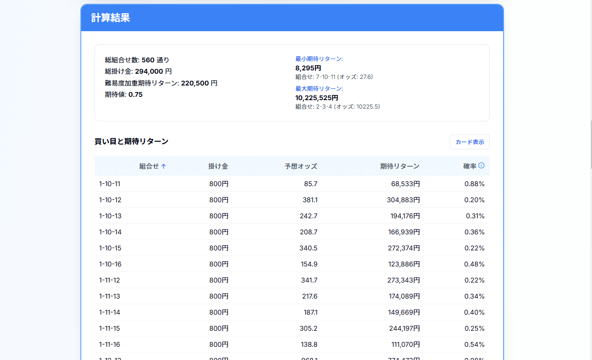

# 3連複期待リターン計算ツール

競馬の3連複の期待リターンを計算するためのWebアプリケーションです。単勝オッズから理論的な3連複オッズを推定し、掛け金と組み合わせて期待リターンを計算します。また、独自の難易度加重アルゴリズムを用いて、より現実的な期待値の算出を実現しています。

## 特徴

### 1. 期待値計算システム
- 単勝オッズから3連複の理論オッズを推定
- 確率の正規化による計算処理
- 各組み合わせの期待値計算

### 2. ユーザーインターフェース
- レスポンシブデザイン
- カード/テーブル表示の切り替え
- リアルタイム計算

### 3. データ表示機能
- 全組み合わせの表示
- ソート機能
- 統計情報の表示

### 4. 手動データ入力
- 単勝オッズの手動入力
- 馬名・馬番の手動入力

## 計算ロジック詳細

### 1. 確率計算システム
- 単勝オッズから各馬の理論的勝率を算出
- 確率の正規化による調整
- 3連複確率の計算
  - 独立性を仮定した確率の掛け算
  - 組み合わせの考慮

### 2. オッズ計算システム
- 正規化された確率の逆数に0.75を掛けて理論オッズを算出
- 控除率25%を考慮

### 3. 期待値計算システム
- 理論オッズと確率から期待値を計算
- 任意の重み付けでも期待値は0.75に収束

## 使用技術スタック

### フロントエンド
- Next.js 14（App Router）
  - サーバーコンポーネントの活用
  - 最適化されたルーティング
- TypeScript
  - 厳密な型チェック
  - コード品質の保証
- Tailwind CSS
  - カスタマイズ可能なデザインシステム
  - 効率的なスタイリング
- shadcn/ui
  - アクセシブルなUIコンポーネント
  - カスタマイズ可能なテーマ
- KaTeX
  - 高品質な数式レンダリング
  - インタラクティブな数式表示
- React Query
  - 効率的なデータフェッチング
  - キャッシュ管理
- React Swipeable
  - スムーズなスワイプ操作
  - マルチタッチ対応

### バックエンド
- Next.js API Routes
  - サーバーレス関数
  - エッジコンピューティング対応
- Cheerio
  - 高速なWebスクレイピング
  - 効率的なDOM操作
- Axios
  - 信頼性の高いHTTP通信
  - リクエスト/レスポンスの変換

## 主要機能詳細

### 1. 基本設定システム
- 馬の頭数設定
  - 最大18頭まで対応
  - 動的なフォーム生成
- 詳細な重み付け設定
  - 0-1000の精密なスケール
  - プリセット機能
- オッズ入力システム
  - 手動入力対応
  - 自動取得との切り替え
  - バリデーション機能

### 2. レース連携システム
- 包括的なレース一覧
  - リアルタイムの更新
  - フィルタリング機能
- 自動データ取得
  - インテリジェントなスクレイピング
  - エラーハンドリング
- スマートな馬名入力
  - 自動補完機能
  - 履歴管理

### 3. 計算結果表示システム
- 詳細な統計情報
  - 組み合わせ数の動的計算
  - 総投資額の集計
  - 期待リターンの多角的分析
- パフォーマンス指標
  - リスク調整済みリターン
  - シャープレシオ
  - 最大ドローダウン

### 4. 可視化システム
- マルチビュー表示
  - カスタマイズ可能なテーブル
  - インタラクティブなカード
- 高度なソート機能
  - マルチカラムソート
  - カスタムソートロジック
- ページネーション
  - 効率的なデータ表示
  - スムーズなナビゲーション

## 使用方法

### 1. 基本的な操作手順
1. 各馬の重みを設定
   - スライダーで調整（0-1000）
   - 数値入力も可能
   - スワイプやマウスホイールでの微調整
2. 単勝オッズを入力
   - 手動入力
   - レース選択からの自動取得
3. 計算ボタンをクリック
4. 結果の確認と分析

### 2. 表示モードの切り替え
- テーブル表示（デフォルト）
  - 全データの一覧性重視
  - ソート機能で比較分析
  - PC版は20件ずつ表示
- カード表示
  - 視覚的な情報把握
  - スマホ版は10件ずつ表示
  - PC版は30件ずつ表示

### 3. 計算結果の見方
- 総合情報
  - 総組み合わせ数
  - 総掛け金
  - 難易度加重期待リターン
  - 期待値
- 個別組み合わせ情報
  - 馬番組み合わせ
  - 掛け金
  - 予想オッズ
  - 期待リターン
  - 的中確率