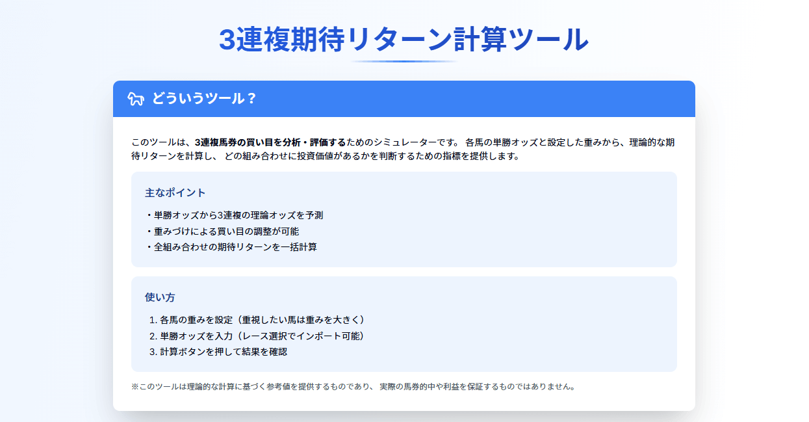

# 3連複 買い目分析

競馬の3連複の買い目を分析し、推奨される組み合わせを提示するWebアプリケーション。

**[Demo](https://keiba-six.vercel.app/)**



## 概要

単勝オッズと複勝オッズという2つの異なる市場データを使い、3連複の各組み合わせの期待回収率を推定する。単一モデルでは期待値が必ず0.75（控除率25%）に固定されるが、2つのデータソースのズレを利用することで、市場が過小評価している組み合わせを検出できる。

### 仕組み

- **単勝オッズ** → 市場の3連複オッズを推定（価格モデル）
- **複勝オッズ** → 3着以内確率を推定（確率モデル）
- **期待回収率** = 0.75 × 確率モデル ÷ 価格モデル

100%を超える組み合わせは、複勝市場が単勝市場より高く評価している = バリューベット候補。

### 推奨度分類（2軸）

各組み合わせを的中確率と期待回収率で分類し、5段階の推奨度を付与。

| ティア | 条件 |
|--------|------|
| 推奨 | 的中確率 ≥ 中央値 & 期待回収率 ≥ 中央値 |
| 有望 | 的中確率 ≥ 中央値 & 期待回収率 ≥ 100% |
| 堅実 | 的中確率 ≥ 中央値 & 期待回収率 < 100% |
| 穴狙い | 的中確率 < 中央値 & 期待回収率 ≥ 中央値 |
| 非推奨 | 的中確率 < 中央値 & 期待回収率 < 中央値 |


## 技術スタック

| カテゴリ | 技術 |
|---------|------|
| フレームワーク | Next.js 14 (App Router) |
| 言語 | TypeScript |
| スタイリング | Tailwind CSS + shadcn/ui |
| 数式レンダリング | KaTeX (react-katex) |
| データ取得 | TanStack Query + Axios |
| スクレイピング | Cheerio (サーバーサイド) |
| ホスティング | Vercel |

## 技術的なポイント

### 2データソースモデル
単勝オッズと複勝オッズを別々のデータソースとして扱い、両者の乖離からバリューを検出。単一モデルでは数学的に不可能な「期待回収率 ≠ 75%」を実現。

### サーバーサイドスクレイピング
Next.js API Routesで keibalab.jp から全会場の全レースのオッズをリアルタイム取得。日付選択に対応し、`Cache-Control`によるHTTPキャッシュで外部サイトへの負荷を抑制。

### 戦略比較
「推奨のみ」「推奨＋有望」「有望のみ」の3つの購入戦略について、点数・投資額・的中率・期待回収率をポートフォリオレベルで比較表示。

### コンポーネント設計

```
src/
├── lib/calculator/        # 計算ロジック（型定義・期待回収率算出・Harvilleフォールバック）
├── hooks/                 # カスタムHooks（状態管理・データ取得）
└── components/calculator/ # UIコンポーネント（15個）
```

## ローカル開発

```bash
npm install
npm run dev
# http://localhost:3000
```
